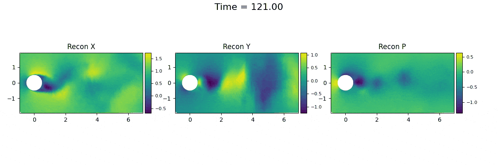
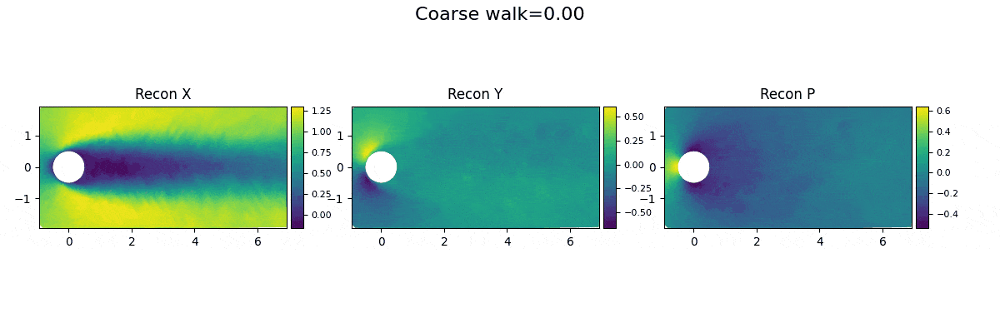

<!-- markdownlint-disable MD013 -->
## Reference

- [Predicting Physics in Mesh-reduced Space with Temporal Attention](https://arxiv.org/abs/2201.09113)
## H2 - Example of a training trajectory

## H2 - Reconstruction (test trajectory 90) from GAE with a triplet loss

## H2 - Interpolation (test trajectory 90) from GAE with a triplet loss

## H2 - Granular walk of test trajectory 90 between timestep 121 and 122, broken down into 11 steps (endpoints included)

## H2 - Coarse walk of test trajectory 90 between timestep 0 and 400, broken down into 21 steps (endpoints included)

## H2 - Extrapolation (test trajectory 90) from GAE with a triplet loss
